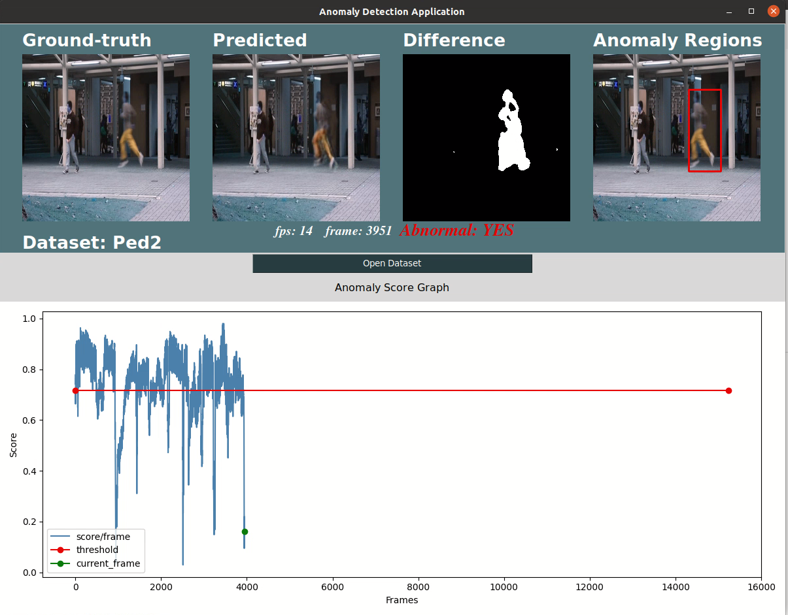
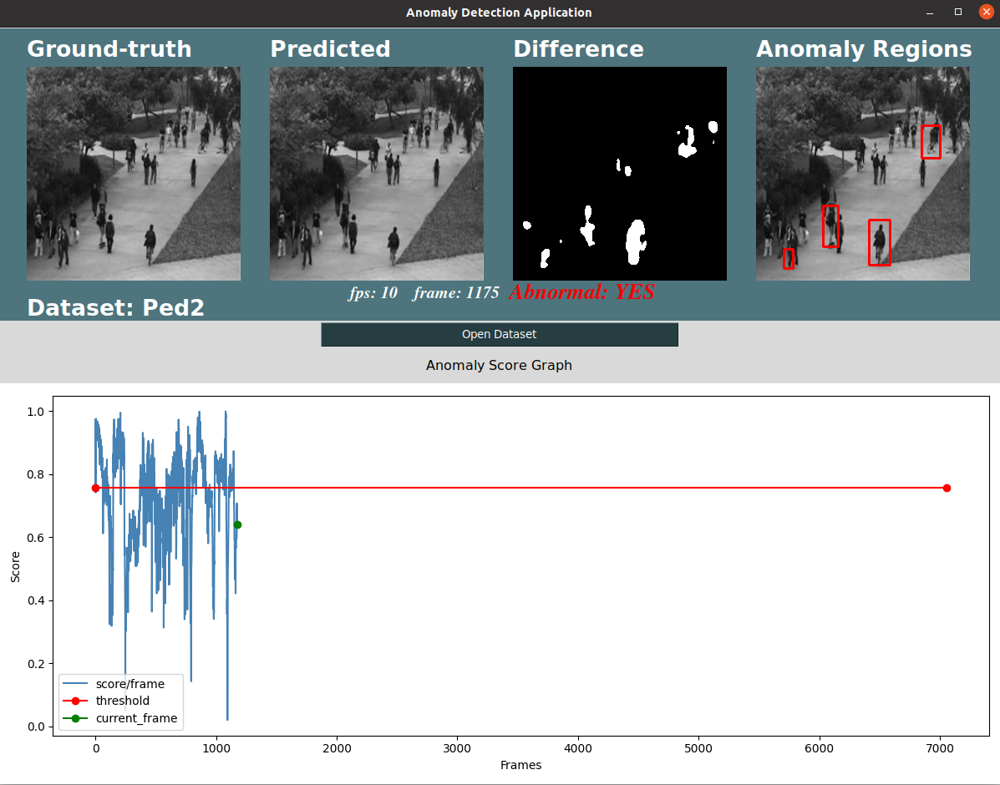
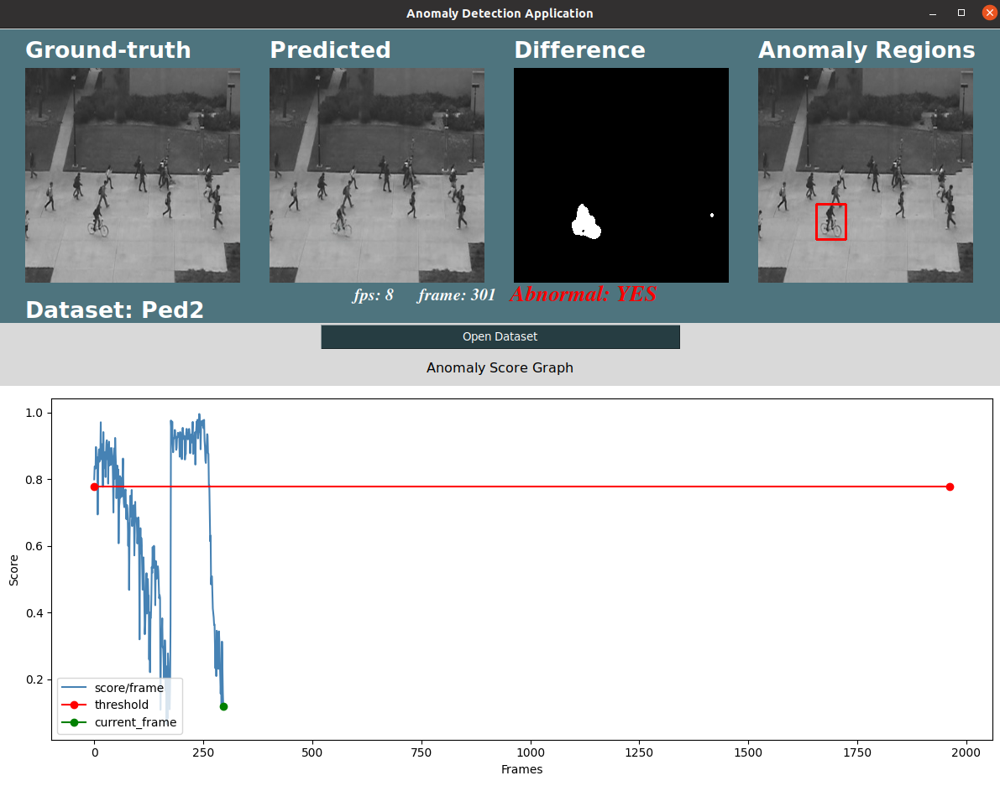

# anodetection-aemem



Abnormal events detection using autoencoder (U-Net) and memory module.

## Demo

-   [[PED1]](https://youtu.be/LHS30qyfB9M)
-   [[PED2]](https://youtu.be/VOdZ9VEGnrA)
-   [[Avenue]](https://youtu.be/YmsGYJg_HVw)

## Dataset

-   [[download directly]](http://101.32.75.151:8181/dataset/)
-   [[description]](https://github.com/StevenLiuWen/ano_pred_cvpr2018)

## How to run

Use this folder structure, copy dataset into folder `./dataset/`. For example, `./dataset/ped2/`.

1. Training: Use this command, and you can freely define parameters with your own settings like

```
python3 Train.py --dataset_type dataset_type
```

Example for `avenue`:

```
python3 Train.py --dataset_type avenue
```

Need to help? Run this command:

```
python3 Train.py -h
```

2. Evaluation

```
python3 Evaluate.py --dataset_type dataset_type --model_dir your_model.pth --m_items_dir your_m_items.pt
```

Example for `avenue`:

```
python3 Evaluate.py --dataset_type avenue --model_dir ./pre_trained_model/avenue_prediction_model.pth --m_items_dir ./pre_trained_model/avenue_prediction_keys.pt
```

Need to help? Run this command:

```
python3 Evaluate.py -h
```

2. Run demo app

```
python3 app.py --method pred --dataset_type dataset_type
```

Example for `avenue`:

```
python3 app.py --method pred --dataset_type avenue
```

## Model

### pre-trained model

#### Fully pre-trained

-   [[fully pre-trained]](https://drive.google.com/drive/folders/1nP1O9YaZ3TW_CraeI9iuFggKc6Kl324L?usp=sharing): Please download and place it into root folder of project

#### Prediction hightest

-   [[ped1]](https://drive.google.com/file/d/1qMFZ2umfqJTh6vw6KjrW9dbj0fRy0A-Z/view?usp=sharing)
-   [[ped2]](https://drive.google.com/file/d/1luwmkFoFFJNqgLGJEA2MoUod71EfTuHf/view?usp=sharing)
-   [[avenue]](https://drive.google.com/file/d/1_scFKFs-pNlUsQ76t35206YiYzmM-izU/view?usp=sharing)

### Paper pre-trained model

-   [[ped2 - pred]](https://drive.google.com/file/d/14RHewQ1VtEpVmo4d9b5U0OgwL8PF2VYa/view)
-   [[ped2 - recons]](https://drive.google.com/file/d/1zsqKv0jZMejsuA-JuZoWwn_pg2fwxTW7/view)
-   [[avenue - pred]](https://drive.google.com/file/d/1sSntCNvgSzdHSsSGCbDmb49PemJ0K5p1/view)
-   [[avenue - recons]](https://drive.google.com/file/d/19UDRv-8JtClX4prParZRkLvGwYbLuGvc/view)

## Works Cited

-   [[Learning Memory-guided Normality for Anomaly Detection]](https://openaccess.thecvf.com/content_CVPR_2020/papers/Park_Learning_Memory-Guided_Normality_for_Anomaly_Detection_CVPR_2020_paper.pdf) - [[Github]](https://github.com/cvlab-yonsei/MNAD/tree/master)

## Demo Images

### Avenue


### Ped1



### Ped2


