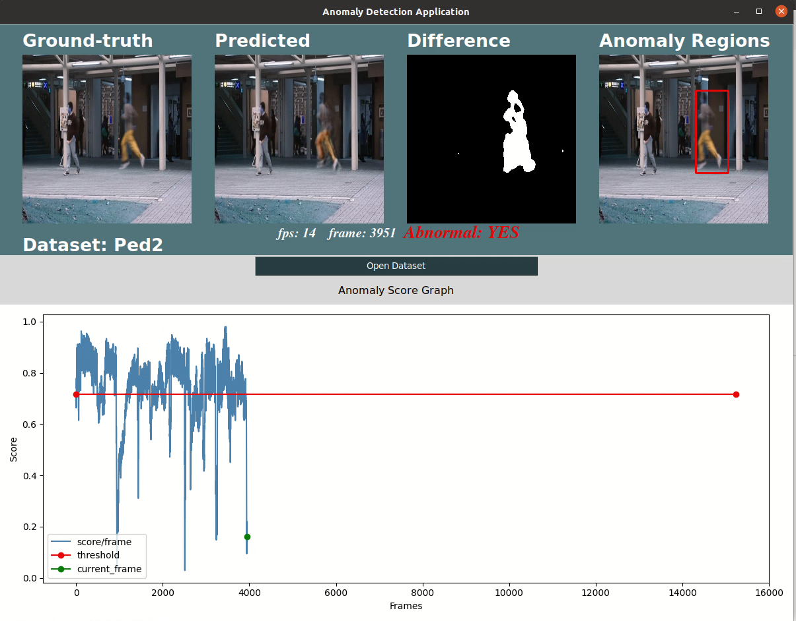

# HƯỚNG DẪN CÀI ĐẶT, SỬ DỤNG SOURCE CODE

# 1. Cấu trúc thư mục

```
.
├── AppDemo.py                          // Ứng dụng demo
├── common                              // Hằng số của ứng dụng demo
│   └── consts.py
├── cross_evaluate                      // Kết quả đánh giá chéo mô hình
│   └── README.md
├── data_labels                         // Thư mục chứa nhãn khung hình của các tập dữ liệu
│   ├── frame_labels_avenue.npy
│   ├── frame_labels_ped1.npy
│   ├── frame_labels_ped1_rebuild.npy
│   ├── frame_labels_ped2.npy
│   └── frame_labels_shanghai.npy
├── dataset                             // Thư mục chứa tập dữ liệu (huấn luyện/kiểm thử/chạy demo)
│   ├── ped1
│   │   │── output                      // Thư mục chứa khung hình tái tạo/dự đoán
│   │   │    │── anomaly_score.npy      // File đánh giá điểm bất thường của khung hình
│   │   │    │                          // sau khi chạy đánh giá với tập dữ liệu tương ứng
│   │   │    │── optimal_threshold.npy  // File lưu trữ threshold tối ưu sau khi đánh giá
│   │   │    └── frames
│   │   │── training                    // Thư mục chứa khung hình huấn luyện
│   │   │    └── frames
│   │   └── testing                     // Thư mục chứa khung hình đánh giá
│   │        └── frames
│   ├── ped2
│   └── avenue
├── EvaluateCombine.py                  // Mô-đun đánh giá mô hình (không bỏ qua những khung hình đầu tiên)
├── Evaluate_PixelLevel.py              // Mô-đun đánh giá mô hình với mức điểm ảnh
├── EvaluatePredFullFrame.py            // Mô-đun đánh giá mô hình (dự đoán ngẫu nhiên những khung hình đầu tiên)
├── Evaluate.py                         // Mô-đun đánh giá mô hình (bỏ qua những khung hình đầu tiên)
├── EvaluateWithSSIMLoss.py             // Mô-đun đánh giá mô hình với hàm lỗi SSIM
├── fully_pred_anomal_score             // Kết quả đánh giá mô hình kết hợp (không bỏ qua những khung hình đầu tiên)
│   └── README.md
├── guild
│   └── README.md
├── helpers                             // Hỗ trợ gắn nhãn
│   ├── get_avenue_pixel_labels.py
│   └── get_ped1_frame_labes.py
├── image_similarity                    // Mô-đun đánh giá khung hình tái tạo, dự đoán so với khung hình gốc
│   ├── CompareFeatures.py
│   ├── CompareHistogram.py
│   └── ImageDifference.py
├── model                               // Cài đặt chính của mô hình, mô-đun bộ nhớ
│   ├── final_future_prediction_with_memory_spatial_sumonly_weight_ranking_top1.py
│   ├── memory_final_spatial_sumonly_weight_ranking_top1.py
│   ├── Memory.py
│   ├── Reconstruction.py
│   └── utils.py
├── pre_trained_model                   // Thư mục chứa mô hình do nhóm huấn luyện
│   ├── defaults                        // Mô hình với tham số mặc định và cmd chạy
│   │   └── README.md
│   ├── inframes-and-msize_changed      // Mô hình với thay đổi phần tử bộ nhớ và khung hình đầu vào và cmd chạy
│   │   ├── 03-and-09
│   │   │   └── README.md
│   │   ├── 03-and-11
│   │   │   └── README.md
│   │   ├── 05-and-09
│   │   │   └── README.md
│   │   └── 05-and-11
│   │       └── README.md
│   ├── inframes_changed                // Mô hình với thay đổi phần tử bộ nhớ và cmd chạy
│   │   ├── 03
│   │   │   └── README.md
│   │   └── 05
│   │       └── README.md
│   ├── msize_changed                   // Mô hình với khung hình đầu vào và cmd chạy
│   │   ├── 09
│   │   │   └── README.md
│   │   └── 11
│   │       └── README.md
│   ├── papers                          // Mô hình gốc của bài báo và cmd chạy
│   │   └── README.md
│   ├── README.md
│   └── SSIM
│       └── README.md
├── README.md
├── Train.py                            // Mô-đun huấn luyện mô hình
├── TrainWithSSIMLoss.py
├── utils.py
└── video_capture                       // Mô-đun đọc khung hình và hỗ trợ chạy demo, đánh giá điểm ảnh
    └── VideoCapture.py
```

# 2. Yêu cầu về phần cứng, môi trường và thư viện liên quan

-   Hệ điều hành: Windows 10, Linux (Ubuntu 20.04)
-   Card đồ họa rời, có hỗ trợ CUDA
-   Python: phiên bản `Python 3.8.10`, link cài đặt (https://www.python.org/downloads/release/python-3810)
-   Pip: trình quản lý gói (package) cho python
    -   Windows: https://www.geeksforgeeks.org/how-to-install-pip-on-windows
    -   Linux: `sudo apt install python3-pip` (https://www.geeksforgeeks.org/how-to-install-pip-in-linux)
-   Các thư viện liên quan và lệnh cài đặt thông qua `pip3`:

```bash
# numpy - Tính toán với mảng nhiều chiều
pip3 install numpy
```

```bash
# pytorch (hỗ trợ Deep Learning): Nhóm sử dụng phiên bản LTS (1.8.2) và CUDA phiên bản 1.11 - https://pytorch.org/
# Cài đặt cho Windows
pip3 install torch==1.8.2 torchvision==0.9.2 torchaudio===0.8.2 \
--extra-index-url https://download.pytorch.org/whl/lts/1.8/cu111

# Cài đặt cho Linux
pip3 install torch==1.8.2 torchvision==0.9.2 torchaudio==0.8.2 \
--extra-index-url https://download.pytorch.org/whl/lts/1.8/cu111
```

```bash
# opencv-python (cv2) - Đọc/ghi hình ảnh
pip3 install opencv-python
```

```bash
# scikit-learn - Tính ROC, AUC
pip3 install scikit-learn
```

```bash
# matplotlib - Vẽ biểu đồ
pip3 install matplotlib
```

```bash
# Pillow (PIL) - Xử lý hình ảnh
pip3 install Pillow
```

```bash
# imutils
pip3 install imutils
```

```bash
# tkinter - Vẽ giao diện ứng dụng demo
pip3 install tk # Windows: https://www.geeksforgeeks.org/how-to-install-tkinter-in-windows/

sudo apt-get install python-tk # Linux: https://www.geeksforgeeks.org/how-to-install-tkinter-on-linux/
```

```bash
# torchgeometry - Hỗ trợ tính toán cho hàm lỗi SSIM
pip3 install torchgeometry
```

# 3. Huấn luyện, đánh giá mô hình và chạy mô phỏng

## 3.1. Huấn luyện

### 3.1.1. Các tham số:

-   `gpus`: Số GPU dùng để huấn luyện
-   `batch_size`: batch size trong quá trình huấn luyện, mặc định là `4`
-   `epochs`: Số epochs trong quá trình huấn luyện, mặc định là `60`
-   `loss_compact`: Giá trị cho hàm lỗi compactness
-   `loss_separate`: Giá trị cho hàm lỗi separateness
-   `h`: Chiều cao của ảnh đầu vào mô hình, mặc định là `256 pixel`
-   `w`: Chiều rộng của ảnh đầu vào mô hình, mặc định là `256 pixel`
-   `c`: Số kênh của ảnh đầu vào mô hình, mặc định là `3 kênh`
-   `method`: Phương thức huấn luyện mô hình (tái tạo/dự đoán) mặc định là dự đoán khung hình `pred`
-   `lr`: Giá trị của tỷ lệ học (learning rate), mặc định là `2e-4`
-   `t_length`: Chiều dài chuỗi khung hình đầu vào của mô hình, mặc định là `5`
-   `fdim`: Số kênh của mỗi đặc trưng - features, mặc định là `512`
-   `mdim`: Số kênh của mỗi phần tử bộ nhớ, mặc định là `512`
-   `msize`: Số lượng phần tử trong mô-đun bộ nhớ
-   `num_workers`: Số lượng tiến trình con trong quá trình tải dữ liệu huấn luyện, mặc định là `2`
-   `dataset_type`: Loại dataset dùng để huấn luyện (ped1, ped2, avenue), mặc định là `ped2`
-   `dataset_path`: Thư mục chứa tập dữ liệu huấn luyện, đánh giá, mặc định là `./dataset`
-   `exp_dir`: Thư mục chứa đầu ra của mô hình đã huấn luyện, log trong quá trình huấn luyện, đánh giá `./exp`
    mặc định output của quá trình huấn luyện sẽ nằm ở thư mục `./exp/{dataset_type}/{method}/log`

### 3.1.2. Chạy huấn luyện mô hình:

#### 3.1.2.1. Chạy huấn luyện mô hình mặc định

-   Mở `terminal`, `cd` vào thư mục gốc chứa source code của khóa luận `anodetection-aemem`
-   Chạy lệnh:

```
python3 Train.py --tham_so_1 gia_tri_1 --tham_so_2 gia_tri_2
```

Ví dụ để huấn luyện mô hình cho tập dữ liệu `avenue` và phương thức
dự đoán khung hình `pred` ta chạy lệnh:

```
python3 Train.py --method pred --dataset_type avenue
```

Sau khi chạy xong lệnh trên cho tập dữ liệu `avenue` với các tham số tương ứng trên,
output mặc định sẽ được lưu ở thư mục

-   Mô hình đã huấn luyện: `./exp/avenue/pred/avenue/log/avenue_prediction_model.pth`
-   Phẩn tử bộ nhớ: `./exp/avenue/pred/log/avenue_prediction_keys.pt`
-   File log (giá trị hàm lỗi qua từng epochs): `./exp/avenue/pred/log/log.txt`

#### 3.1.2.2. Chạy huấn luyện mô hình với hàm lỗi SSIM

-   Mở `terminal`, `cd` vào thư mục gốc chứa source code của khóa luận `anodetection-aemem`
-   Chạy lệnh:

```
python3 TrainWithSSIMLoss.py --tham_so_1 gia_tri_1 --tham_so_2 gia_tri_2
```

Ví dụ để huấn luyện mô hình với hàm lỗi SSIM cho tập dữ liệu `avenue` và phương thức
dự đoán khung hình `pred` ta chạy lệnh:

```
python3 TrainWithSSIMLoss.py --method pred --dataset_type avenue
```

Sau khi chạy xong lệnh trên cho tập dữ liệu `avenue` với các tham số tương ứng trên,
output mặc định sẽ được lưu ở thư mục

-   Mô hình đã huấn luyện: `./exp/avenue/pred/avenue/log/avenue_prediction_model.pth`
-   Phẩn tử bộ nhớ: `./exp/avenue/pred/log/avenue_prediction_keys.pt`
-   File log (giá trị hàm lỗi qua từng epochs): `./exp/avenue/pred/log/log.txt`

## 3.2. Đánh giá

### 3.2.1. Các tham số:

-   `gpus`: Số GPU dùng để chạy đánh giá mô hình
-   `batch_size_test`: batch size trong quá trình đánh giá, mặc định là `1`
-   `h`: Chiều cao của ảnh đầu vào mô hình, mặc định là `256 pixel`
-   `w`: Chiều rộng của ảnh đầu vào mô hình, mặc định là `256 pixel`
-   `c`: Số kênh của ảnh đầu vào mô hình, mặc định là `3 kênh`
-   `method`: Phương thức huấn luyện mô hình (tái tạo/dự đoán) mặc định là dự đoán khung hình `pred`
-   `t_length`: Chiều dài chuỗi khung hình đầu vào của mô hình, mặc định là `5`
-   `alpha`: Hệ số căn chỉnh, mặc định là `0.6`
-   `th`: ngưỡng phân loại bất thường, mặc định là `0.01`
-   `num_workers_test`: Số lượng workers trong quá trình tải dữ liệu đánh giá, mặc định là `1`
-   `dataset_type`: Loại dataset dùng để huấn luyện (ped1, ped2, avenue), mặc định là `ped2`
-   `dataset_path`: Thư mục chứa tập dữ liệu huấn luyện, đánh giá, mặc định là `./dataset`
-   `model_dir`: Đường dẫn tới file mô hình đã huấn luyện, mặc định là `./pre_trained_model/defaults/ped2_prediction_model.pth`
-   `m_items_dir`: Đường dẫn tới bộ nhớ lưu trữ đặc trưng đã huấn luyện, mặc định là `./pre_trained_model/defaults/ped2_prediction_keys.pt`
-   `exp_dir`: Thư mục chứa đầu ra của mô hình đã huấn luyện, log trong quá trình huấn luyện, đánh giá `./exp`
    mặc định output của quá trình huấn luyện sẽ nằm ở thư mục `./exp/{dataset_type}/{method}/log`
-   `is_save_output`: Cờ đánh dấu có lưu output của khung hình trong quá trình đánh giá hay không, mặc định là `true`

### 3.2.2. Các tham số (trường hợp cải tiến đánh giá cho những khung hình đầu tiên):

Thay đổi 2 tham số: `model_dir`, `m_items_dir` thành các tham số sau:

-   `pred_model_dir`: Đường dẫn tới file mô hình dự đoán đã huấn luyện,
    mặc định là `./pre_trained_model/defaults/ped2_prediction_model.pth`
-   `pred_m_items_dir`: Đường dẫn tới bộ nhớ lưu trữ đặc trưng với khung hình dự đoán đã huấn luyện,
    mặc định là `./pre_trained_model/defaults/ped2_prediction_keys.pt`
-   `recon_model_dir`: Đường dẫn tới file mô hình dự đoán đã huấn luyện,
    mặc định là `./pre_trained_model/recon/ped2_reconstruction_model.pth`
-   `recon_m_items_dir`: Đường dẫn tới bộ nhớ lưu trữ đặc trưng với khung hình tái tạo đã huấn luyện,
    mặc định là `./pre_trained_model/recon/ped2_reconstruction_keys.pt`

### 3.2.3. Chạy đánh giá mô hình:

#### 3.2.3.1. Mặc định:

-   Mở `terminal`, `cd` vào thư mục gốc chứa source code của khóa luận `anodetection-aemem`
-   Chạy lệnh:

```
python3 Evaluate.py --tham_so_1 gia_tri_1 --tham_so_2 gia_tri_2
```

Ví dụ đánh giá mô hình với tập dữ liệu `avenue`, phương thức dự đoán khung hình `pred`,
mô hình được lưu ở `./pre_trained_model/defaults/avenue_prediction_model.pth`, phần tử bộ nhớ được
lưu ở `./pre_trained_model/defaults/avenue_prediction_keys.pt` ta chạy lệnh:

```
python3 Evaluate.py --method pred --dataset_type avenue --model_dir ./pre_trained_model/defaults/avenue_prediction_model.pth \
--m_items_dir ./pre_trained_model/defaults/avenue_prediction_keys.pt
```

Sau khi chạy xong lệnh trên cho tập dữ liệu `avenue` với các tham số tương ứng trên, output:

-   Hiệu suất: In ra trên terminal chạy lệnh
-   Khung hình dự đoán/tái tạo: mặc định được lưu ở `./dataset/avenue/output/frames`

#### 3.2.3.2. Đánh giá mô hình với hàm lỗi SSIM:

Lưu ý: Mô hình phải được huấn luyện với hàm lỗi SSIM

-   Mở `terminal`, `cd` vào thư mục gốc chứa source code của khóa luận `anodetection-aemem`
-   Chạy lệnh:

```
python3 EvaluateWithSSIMLoss.py --tham_so_1 gia_tri_1 --tham_so_2 gia_tri_2
```

#### 3.2.3.3. Đánh giá mô hình dự đoán với tất cả khung hình:

Trường hợp này sẽ không bỏ sót những khung hình đầu tiên, thay vào đó sẽ dự đoán với tỉ lệ
50% đúng và 50% sai

-   Mở `terminal`, `cd` vào thư mục gốc chứa source code của khóa luận `anodetection-aemem`
-   Chạy lệnh:

```
python3 EvaluatePredFullFrame.py --tham_so_1 gia_tri_1 --tham_so_2 gia_tri_2
```

#### 3.2.3.4. Đánh giá mô hình dự đoán với tất cả khung hình (kết hợp với mô hình tái tạo):

-   Mở `terminal`, `cd` vào thư mục gốc chứa source code của khóa luận `anodetection-aemem`
-   Chạy lệnh:

```
python3 EvaluateCombine.py --tham_so_1 gia_tri_1 --tham_so_2 gia_tri_2
```

## 3.3. Chạy ứng dụng demo

### 3.3.1. Các tham số:

-   `t_length`: Chiều dài chuỗi khung hình đầu vào của mô hình, mặc định là `5`
-   `dataset_type`: Loại dataset dùng để chạy demo (ped1, ped2, avenue), mặc định là `ped2`

### 3.3.1. Cách chạy demo:

#### Lưu ý: Cần phải có output khung hình của quá trình đánh giá trước khi chạy demo

-   Mở `terminal`, `cd` vào thư mục gốc chứa source code của khóa luận `anodetection-aemem`
-   Chạy lệnh:

```
python3 AppDemo.py --tham_so_1 gia_tri_1 --tham_so_2 gia_tri_2
```

Ví dụ để chạy demo cho tập dữ liệu `ped2`, phương thức dự đoán khung hình `pred` và các tham số còn lại mặc định, ta chạy lệnh:

```
python3 AppDemo.py --dataset_type avenue
```

Hình ảnh khi chạy demo



# 4. Link github của khóa luận:

https://github.com/anhhuu/anodetection-aemem
